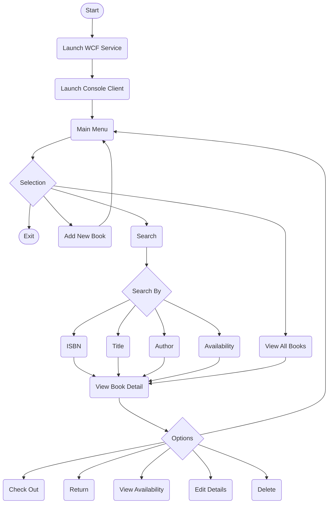

# LibraryManagementSOAPApplication

WCF-based library management system with a console client, built in C# for Windows.

## Features

- Add, update, and delete books from the library
- Check out and return books with availability tracking
- Search by ISBN, title, author, or availability status
- ISBN-13 format validation with automatic formatting (strips dashes and spaces)
- Detailed validation error messaging via typed WCF FaultExceptions
- Interactive console UI with y/n prompts and confirmation steps

## Requirements
- .NET Framework 4.8 (Windows only)
- Visual Studio 2022 or later

## Setup
1. Clone the repository
2. Open `LibraryManagementService.sln` in Visual Studio, make sure the project root is selected, and run it - this starts the WCF service (you'll know you were successful if a web browser opens; if a popup window opens, you have the wrong file selected in the solution explorer)
3. Open `LibraryManagementClient.sln` in a separate Visual Studio instance and run it - this launches the console client

> ⚠️ The service **must** be running before the client

## How It Works

